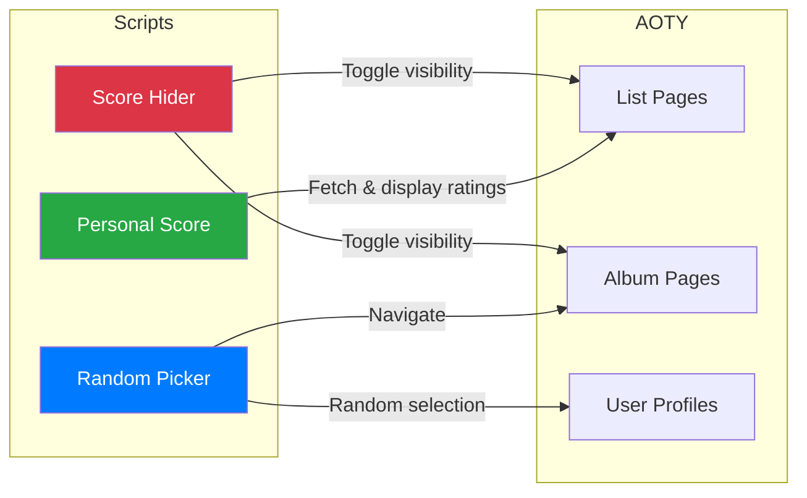

# AOTY Tampermonkey Scripts

Professional userscripts enhancing [Album of the Year](https://www.albumoftheyear.org/) functionality.

## Scripts



| Script | File | Purpose |
|--------|------|---------|
| **Score Hider** | `aoty-score-hider.user.js` | Toggle all score visibility with persistent state |
| **Personal Score** | `aoty-personal-score.user.js` | Display your ratings on list pages without visiting albums |
| **Random Picker** | `aoty-random-album.user.js` | Select random albums from any user's ratings |

## Installation

**Prerequisites:** [Tampermonkey](https://www.tampermonkey.net/) extension

**Install:** Open any `.user.js` file in your browser - Tampermonkey will automatically detect and install it.

Alternative: Drag `.user.js` files into browser, or manually create new script in Tampermonkey and paste contents.

---

## Score Hider

Toggle button in top-right corner to hide/show all ratings across AOTY.

**Features:**
- Persistent state via `GM_setValue`/`GM_getValue`
- Real-time updates with MutationObserver
- Hides: critic/user scores, track ratings, rating bars, must-hear badges

**Usage:**
- **Red button** = Scores hidden
- **Green button** = Scores visible

**Implementation:**
- 40+ CSS selectors target all score elements
- Debounced MutationObserver (100ms) handles dynamic content
- CSS `display: none` for instant toggle

---

## Personal Score

Automatically displays your personal ratings on list pages (homepage, artist pages, genres).

**Features:**
- Cross-origin requests via `GM_xmlhttpRequest`
- In-memory caching to minimize requests
- Batch processing: 5 albums per batch, 500ms delay
- Color-coded bars: green (≥75), yellow (60-74), red (<60)

**How it works:**
1. Detects `.albumBlock` elements with `data-album-id`
2. Fetches album page: `https://www.albumoftheyear.org/album/{id}/`
3. Parses `#currentRatingBlock.yourOwn .ratingValue`
4. Injects rating into existing `.ratingRowContainer` or `.albumListScoreContainer`

**Permissions:**
- `@grant GM_xmlhttpRequest`
- `@connect albumoftheyear.org`

---

## Random Album Picker

Adds "Random" button to user profiles that picks a random album from their entire ratings collection.

**Features:**
- Pagination support (up to 100 pages)
- Deduplication with Set
- Rating banner on destination album (auto-dismisses after 8s)
- localStorage persistence for banner display

**Algorithm:**
1. Fetch `/user/{username}/ratings/?page={n}`
2. Parse `.albumBlock` elements, extract album data
3. Continue until no `.pagination .next` or 100 pages reached
4. Select random album: `Math.floor(Math.random() * albums.length)`
5. Store rating in `localStorage` with timestamp (10s TTL)
6. Navigate to album, display banner with original rating

---

## Architecture

**Shared container:**
```javascript
.aoty-scripts-container {
  position: fixed; top: 20px; right: 20px; z-index: 9999;
}
```

**Lifecycle pattern:**
```javascript
function init() {
  addStyles();
  createButton();
  setupObserver();
}

if (document.readyState === 'loading') {
  document.addEventListener('DOMContentLoaded', init);
} else {
  init();
}
```

**Dynamic content handling:**
```javascript
new MutationObserver(() => {
  clearTimeout(timeout);
  timeout = setTimeout(handler, delay);
}).observe(document.body, { childList: true, subtree: true });
```

## Development

**Extend Score Hider selectors:**
Add to `SCORE_SELECTORS` array (`aoty-score-hider.user.js:17-41`)

**Test pages:**
- Homepage: `/`
- Album: `/album/{id}/`
- Artist: `/artist/{id}/`
- User ratings: `/user/{username}/ratings/`
- Genre: `/genre/`

## Compatibility

Chrome/Edge/Firefox (Tampermonkey) • Safari (Userscripts)

## License

MIT • Inspired by [Rice's AOTY Add-ons](https://greasyfork.org/en/scripts/462348-rice-s-aoty-add-ons)
